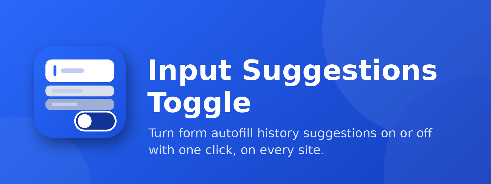

<p align="center">
  
</p>

<h1 align="center">Input Suggestions Toggle</h1>

<p align="center">
  A lightweight Firefox / Waterfox WebExtension that turns the browser's
  <strong>input value suggestions</strong> (the form autofill history dropdown)
  <strong>on or off</strong> for every website with a single click.
</p>

## Features

- One-click toggle from the toolbar popup.
- Applies to all sites, frames, and shadow DOM.
- Restores each field's original `autocomplete` value when re-enabled.
- Setting is saved and synced live to all open tabs.

## How it works

Firefox and Waterfox do not expose the `browser.formfill.enable` preference to regular extensions, so this add-on uses the standard approach: a content script forces `autocomplete="off"` on form fields, which suppresses the value-suggestion dropdown. Password-manager (login) filling is separate and unaffected.

## Install

### Temporary (for testing)

1. Open `about:debugging#/runtime/this-firefox`.
2. Click **Load Temporary Add-on**.
3. Select `manifest.json`.

The add-on is removed when the browser closes.

### Permanent (Waterfox)

1. Download the `.xpi` from the [Releases](https://github.com/itsarmen/Firefox-Input-Suggestions-Toggle-Addon/releases) page.
2. Go to Add-ons: open `about:preferences`.
3. Click the **cog/gear** icon.
4. The cog icon displays a dropdown.
5. In the dropdown, click **Install Add-on From File**.
6. Select the `.xpi`.

## Usage

1. Click the toolbar icon.
2. Flip the switch:
   - **On** — native input value suggestions are enabled (default).
   - **Off** — suggestions are disabled on all sites.

## Build

Requires Python 3.

```bash
python build.py            # -> dist/input-suggestions-toggle-1.0.1.xpi
python build.py out/custom.xpi
```

## Project structure

```
manifest.json      Extension manifest (MV3)
content.js         Toggles autocomplete="off" on inputs/textareas
popup.html/js/css  Toolbar toggle UI
icons/             Extension icons (16/32/48/64/128)
assets/            README banner (not packaged)
build.py           Packages the add-on into an .xpi
```

## Author

**Amiran Kimadze (itsarmen)**

- Website: <https://xrow.asia>
- Email: <amoswaper@gmail.com>
- GitHub: <https://github.com/itsarmen>
